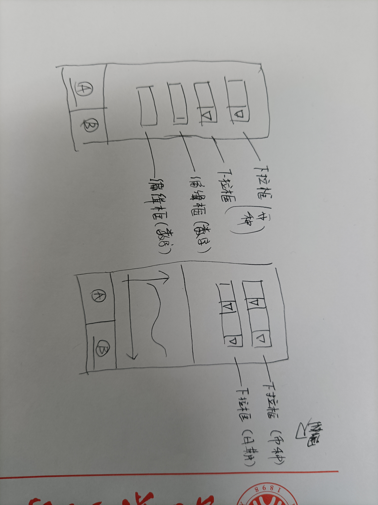

# 快速汇率查询

有时当需要查询汇率时，常常难以快速找到合适的途径，本项目就是为了方便在偶然突发情况下，快速查询实时汇率和一段时间内汇率变化的小工具，打开微信搜索小程序即可使用。项目暂未开发完成上线，敬请期待。

# 支持功能
+ 实时汇率换算
+ 查看一段时间内汇率变化曲线
+ TBC[(欢迎提交issue)](https://github.com/Louis-J/HUILV/issues)

# 项目进度与开发规划
+ 
+ 项目结构(TBC)
## 下一步计划
+ codestyle的选定
+ UI框架的选用和项目UI第一屏的绘制
+ 创建多分支并行开发
+ 学习微信小程序的开发语言规则

# 项目成员
+ [Louis-J](https://github.com/Louis-J)
+ [Vanishing-Cake](https://github.com/VanishingCake)
+ [cbyy3](https://github.com/cbyy3)
+ [susanneli](https://github.com/susanneli)
+ [hellohelen222](https://github.com/hellohelen222)
+

# 附：
## 关于：[开源训练营](https://github.com/kaiyuanshe/Open-source-training-camp)
